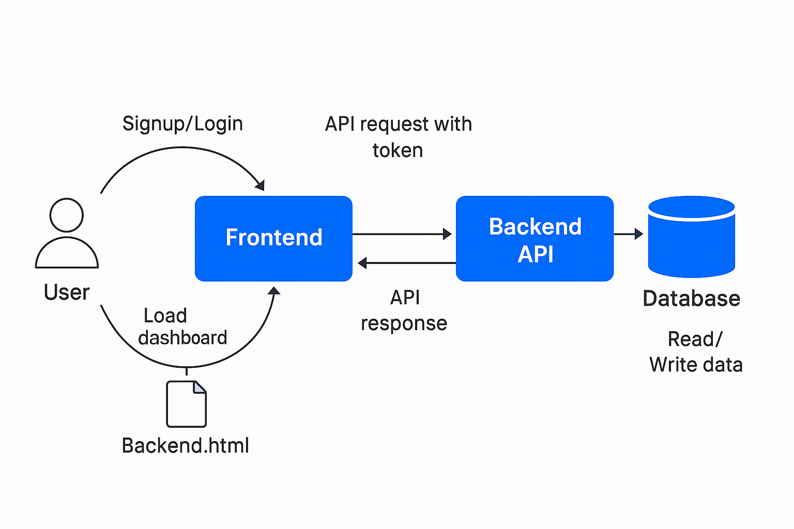
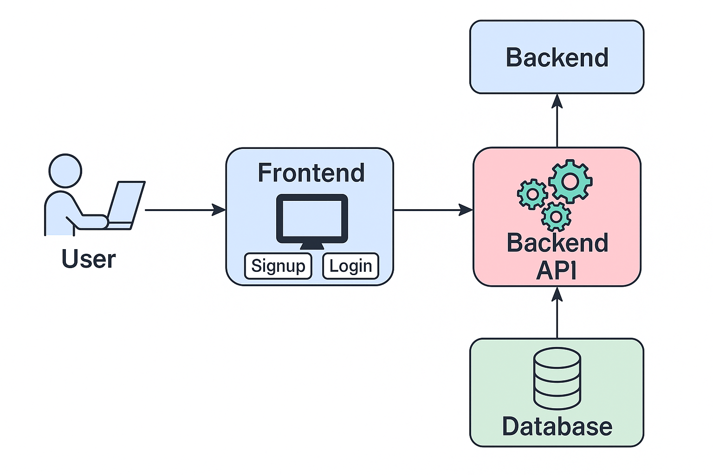
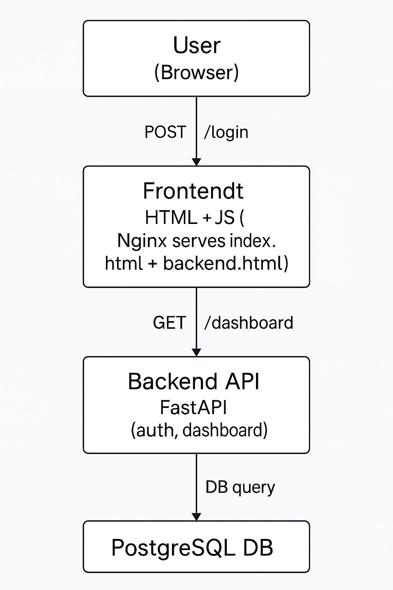

# FastAPI Login System with PostgreSQL and Frontend (Dockerized)




This project is a full-stack login system with:
- **FastAPI** backend for signup/login
- **PostgreSQL** for user storage
- **Static HTML frontend** served using **Nginx**
- Fully containerized using **Docker Compose**

---

## ✅ Features

- User registration (`/signup`)
- User login (`/login`)
- Secure password hashing with bcrypt
- PostgreSQL database
- HTML + JS frontend via Nginx

---

## 🧱 Project Structure

```
login-api/
├── app/                  # FastAPI backend
├── frontend/             # Static HTML/CSS frontend
├── .env                  # DB environment config
├── Dockerfile            # FastAPI container build
├── docker-compose.yml    # Orchestration
├── requirements.txt      # Python dependencies
```

---

## 🚀 Prerequisites

- Docker
- Docker Compose

---

## 🔧 Setup & Run

### 1. Clone the Repository

```bash
git clone <your-repo-url>
cd login-api
```

### 2. Build and Start Containers

```bash
docker compose down --volumes --remove-orphans
docker compose build
docker compose build --no-cache
docker compose up -d
```

- FastAPI API: [http://localhost:8000](http://localhost:8000)
- Swagger Docs: [http://localhost:8000/docs](http://localhost:8000/docs)
- Frontend App: [http://localhost:8080](http://localhost:8080)

- Swagger Docs: [http://localhost:8000/docs](http://server2.anomicatech.com:8000/docs)
- Frontend App: [http://localhost:8080](http://server2.anomicatech.com:8065/)


---

## 🧪 API Endpoints

### POST `/signup`
```json
{
  "username": "john",
  "email": "john@example.com",
  "password": "secret"
}
```

### POST `/login`
```json
{
  "username": "john",
  "password": "secret"
}
```

---

## 🔐 Environment Configuration

`.env` file:

```
POSTGRES_USER=admin
POSTGRES_PASSWORD=admin123
POSTGRES_DB=logindb
POSTGRES_HOST=db
POSTGRES_PORT=5432
```

---

## 📌 Notes

- For production, add HTTPS, authentication tokens (JWT), and input validation.
- You can extend the frontend using React/Vue or template rendering.

---

## Login into DB
```sh
docker exec -it a39659af6f86 psql -U admin -d logindb

-- Show all tables
\dt

-- View structure of a table
\d users

-- Show the first 10 rows of a table
SELECT * FROM users LIMIT 10;

-- List all databases
\l

-- List all users/roles
\du

-- Exit psql
\q
```